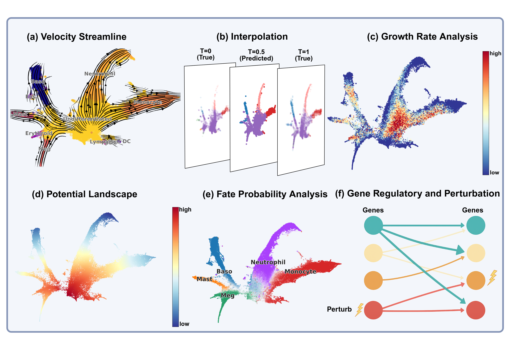

# DeepRUOTv2 (Dynamical Optimal Transport Tools)

**Author**: Zhenyi Zhang, Zihan Wang

This is the DeepRUOTv2 version of our previously published work [DeepRUOT](https://github.com/zhenyiizhang/DeepRUOT). We have improved the implementation of the original DeepRUOT version, offering a more user-friendly interface and establishing default parameters. We have computed results on more datasets presented in our latest work (https://arxiv.org/abs/2505.11197): Mouse Blood Hematopoiesis, Embryoid Body, Pancreatic $\beta$ -cell differentiation and  A549 EMT.

Based on the DeepRUOTv2 framework, we implement a suite of dynamical optimal transport methods:

- **Dynamical Optimal Transport (OT)**: classical formulation without growth/death processes or stochastic effects.
- **Unbalanced Dynamical OT**: extension of dynamical OT that accounts for growth and death processes, but without stochastic effects.
- **Dynamical Schrödinger Bridge (SB)**: stochastic extension of dynamical OT without growth/death.
- **Regularized Unbalanced Optimal Transport (Unbalanced Schrödinger Bridge)**: general formulation that incorporates both growth/death processes and stochasticity.

Users can flexibly specify the desired model through configuration files to select the appropriate solver for their application. Furthermore, the following downstream analysis can be conducted ([view tutorial](https://deepruot.readthedocs.io/en/latest/notebook/analysis.html)):
<br />
<div align="left">
  <a href="https://github.com/zhenyiizhang/DeepRUOTv2/">
    
  </a>

</div>

If you are interested in further exploring cell-cell interactions from the data, we plan to release the code following the publication of our work.

## Updated
**(2025/08/26)** We conduct the following updates:
* Added a new `use_mass` option to the configuration file. Setting this to `False` disables the growth term.
* The `sigma` parameter can now be set to `0.0` to disable stochastic effects.
* The calculated results can now be automatically evaluated.
* Added a new notebook for downstream analysis at `evaluation/analysis.ipynb` ([view notebook](evaluation/analysis.ipynb), [view tutorial](https://deepruot.readthedocs.io/en/latest/notebook/analysis.html)). This script enables more advanced analyses, including data interpolation, inferring fate probabilities, and further gene-level studies. Raw data containing cell type and gene level information is required to perform these downstream analysis, sample data is provided in the following link ([view sample data](https://drive.google.com/drive/folders/1s2_hsS7WHVo03S4wgrn-w66iBtZPfdpS)).

## Getting Started

1. Clone this repository:

```vim
git clone https://github.com/zhenyiizhang/DeepRUOTv2
```

2. You can create a new conda environment (DeepRUOTv2) using

```vim
conda create -n DeepRUOTv2 python=3.10 ipykernel -y
conda activate DeepRUOTv2
```

3. Install requirements
```vim
cd path_to_DeepRUOTv2
pip install -r requirements.txt
```

## Training DeepRUOTv2

DeepRUOTv2 uses a flexible configuration system, where users can specify the parameters used to train DeepRUOT. We provide example configurations used to train on four scRNA-seq datasets: Mouse Blood Hematopoiesis (50D), Embryoid Body (50D), Pancreatic $\beta$ -cell differentiation (30D) and  A549 EMT (10D). The configurations are stored in the `config/` folder.

To train DeepRUOTv2 on your own dataset, you need to convert your own dataset to a csv file and store it in the `data/` folder. Specifically, the column `samples` refers to the biological time points starting from time 0, and it is recommended to normalize the time scales to a reasonable range. The following columns, starting from `x1`, refer to the gene expression features. After the dataset is prepared, modify these parts in the confuguration file:

```yaml
device: 'cuda' # device to run the model

exp:
  name: "my_experiment"     # Experiment name

data:
  file_path: "data.csv"     # Path to your dataset, your dataset should be prepared as a csv file
  dim: 50                   # Data dimension

model:
  in_out_dim: 50 # Data dimension
```

For other hyperparameters, we recommend using the same settings as `config/weinreb_config.yaml`. Note that the default setting for the hyperparameter `use_pinn`, which controls whether to update the score model in the final training phase, is set to False. Setting it to True may achieve better performance but will significantly increase training time. For more efficient training, we recommend setting it to False. The hyperparameter `use_mass` controls whether the growth term is used, and its default value is set to True. If you encounter  `CUDA out of memory` error, you may set the parameters `sample_size` and `score_batch_size` to smaller values. 

For training, simply specify the path to your configuration file, and run  `train_RUOT.py`:

```bash
python train_RUOT.py --config config/<config_name>.yaml
```

For example, to reproduce our results on the Mouse Blood Hematopoiesis dataset, run:

```bash
python train_RUOT.py --config config/weinreb_config.yaml
```

## Evaluation

 After training, the performance of distribution matching and mass matching will be automatically evaluated using $\mathbf{W}_1$ and $TMV$ (https://arxiv.org/abs/2505.11197). Model checkpoints will be generated in the `results/` directory: `model_final` and `score_final`, which can then be used to inference trajectories. We provide a Jupyter notebook to plot the learned results in `evaluation/plot.ipynb`. Downstream analysis can be conducted using the provided notebook in `evaluation/analysis.ipynb` ([view tutorial](https://deepruot.readthedocs.io/en/latest/notebook/analysis.html)).

## How to cite

If you find this package helpful in your research, we would greatly appreciate it if you could consider citing our following work. We would first like to recommend our new package CytoBridge (https://github.com/zhenyiizhang/CytoBridge), a comprehensive and user-friendly toolkit for dynamical optimal transport and spatiotemproal transcriptomic data that we are actively developing.

The first two papers are our surveys.

- Zhenyi Zhang, Zihan Wang, Yuhao Sun, Jiantao Shen, Qiangwei Peng, Tiejun Li, and Peijie Zhou. “Deciphering cell-fate trajectories using spatiotemporal single-cell transcriptomic data“.  *npj Syst Biol Appl 2025*. (https://www.nature.com/articles/s41540-025-00624-9) 
- Zhenyi Zhang, Yuhao Sun, Qiangwei Peng, Tiejun Li, and Peijie Zhou. “Integrating Dynamical Systems Modeling with Spatiotemporal scRNA-Seq Data Analysis”. In: *Entropy* 27.5, 2025b. ISSN: 1099-4300.

These papers present the core algorithm on which this package is built, as well as other relevant developments.

- Zhenyi Zhang, Tiejun Li, and Peijie Zhou. “Learning stochastic dynamics from snapshots through regularized unbalanced optimal transport”. In: *ICLR 2025 Oral*.
- Zhenyi Zhang, Zihan Wang, Yuhao Sun, Tiejun Li, and Peijie Zhou. “Modeling Cell Dynamics and Interactions with Unbalanced Mean Field Schrödinger Bridge”. In: *NeurIPS 2025*.
- Dongyi Wang, Yuanwei Jiang, Zhenyi Zhang, Xiang Gu, Peijie Zhou, and Jian Sun. “Joint Velocity-Growth Flow Matching for Single-Cell Dynamics Modeling”. In: *NeurIPS 2025*.

Additional related papers may be cited as needed.
- Yuhao Sun, Zhenyi Zhang, Zihan Wang, Tiejun Li, and Peijie Zhou. “Variational Regularized Unbalanced Optimal Transport: Single Network, Least Action”. In: *NeurIPS 2025*.
- Qiangwei Peng, Peijie Zhou, and Tiejun Li. “stVCR: Reconstructing spatio-temporal dynamics of cell development using optimal transport”. In: *Nature Methods*.


## Contact information

If you encounter any issues while running the code, please feel free to contact us and we warmly welcome any discussions and suggestions:

Zhenyi Zhang (zhenyizhang.math@gmail.com)

## License
DeepRUOTv2 is licensed under the MIT License.

```
License

Copyright (c) 2025 Zhenyi Zhang and Zihan Wang

Permission is hereby granted, free of charge, to any person obtaining a copy
of this software and associated documentation files (the "Software"), to deal
in the Software without restriction, including without limitation the rights
to use, copy, modify, merge, publish, distribute, sublicense, and/or sell
copies of the Software, and to permit persons to whom the Software is
furnished to do so, subject to the following conditions:

The above copyright notice and this permission notice shall be included in all
copies or substantial portions of the Software.

THE SOFTWARE IS PROVIDED "AS IS", WITHOUT WARRANTY OF ANY KIND, EXPRESS OR
IMPLIED, INCLUDING BUT NOT LIMITED TO THE WARRANTIES OF MERCHANTABILITY,
FITNESS FOR A PARTICULAR PURPOSE AND NONINFRINGEMENT. IN NO EVENT SHALL THE
AUTHORS OR COPYRIGHT HOLDERS BE LIABLE FOR ANY CLAIM, DAMAGES OR OTHER
LIABILITY, WHETHER IN AN ACTION OF CONTRACT, TORT OR OTHERWISE, ARISING FROM,
OUT OF OR IN CONNECTION WITH THE SOFTWARE OR THE USE OR OTHER DEALINGS IN THE
SOFTWARE.
```
